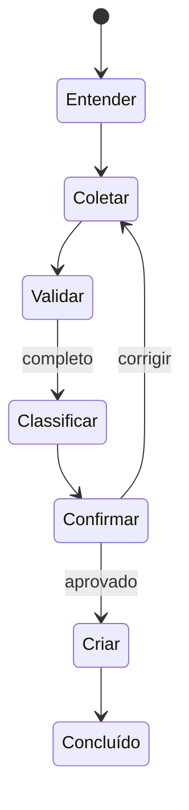

# Hybrid Service Desk Agent

Agente de atendimento com workflow determinístico inspirado em LangGraph: interpretação por IA, regras de negócio, confirmação humana e criação de chamado.

> **Status:** funcional com AWS. O agente usa Amazon Bedrock (Nova 2 Lite) para interpretar a solicitação, DynamoDB para catálogo, sessão e chamados, e API Gateway + Lambda para a API.

```bash
make install
make deploy
make seed
make dev
```

A interface local abre em `http://localhost:3100` e encaminha as mensagens para a API AWS. Informe um problema, confira os campos identificados e confirme: um chamado `INC-...` é gravado de verdade no DynamoDB. Antes do deploy, valide as credenciais com `make doctor`. Para remover os recursos temporários após a gravação, execute `make destroy`.



Os arquivos locais gerados pelo deploy (`.env.aws` e `apps/web/config.local.js`) não são versionados.
