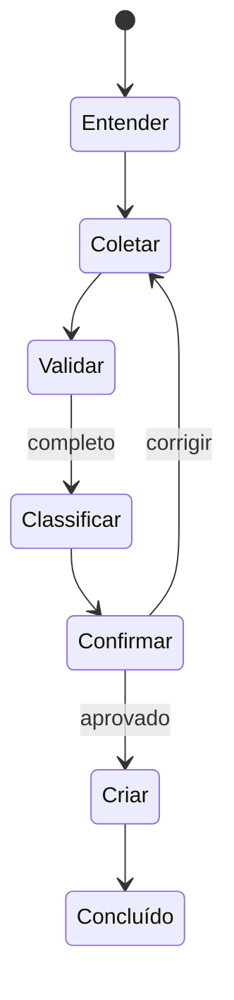

# Hybrid Service Desk Agent

Agente de atendimento com workflow determinístico inspirado em LangGraph: interpretação por IA, regras de negócio, confirmação humana e criação de chamado.

> **Status:** demo local funcional e infraestrutura AWS sintetizada. A execução real do grafo com Bedrock e persistência DynamoDB é a próxima etapa antes de um deploy para gravação.

```bash
make install
make dev
```

A demo local abre em `http://localhost:3100` e não usa credenciais AWS. Para o ciclo temporário com Lambda, DynamoDB, API Gateway e Bedrock, execute `make doctor`, `make deploy`, `make seed` e, após gravar, `make destroy`.



O roteiro de gravação está em [docs/demo-script.md](docs/demo-script.md).
