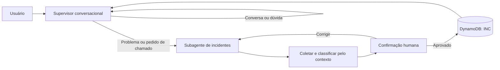

# Hybrid Service Desk Agent

Agente de atendimento executado no Amazon Bedrock AgentCore Runtime com LangGraph, supervisor conversacional, subagente de incidentes, memória de curto prazo, confirmação humana e criação de chamado.

> **Status:** funcional com AWS. O frontend local chama uma API Gateway/Lambda que invoca o AgentCore Runtime. Um supervisor mantém o contexto da conversa por sessão no AgentCore Memory e delega relatos de problema a um subagente LangGraph de abertura de incidentes. O subagente usa Nova 2 Lite para interpretar dados em qualquer ordem e classificar impacto/urgência pelo contexto; após criar o ticket no DynamoDB, devolve o controle ao supervisor.

```bash
make install
make deploy
make seed
make dev
```

A interface local abre em `http://localhost:3100` e encaminha as mensagens para a API AWS. Informe um problema, confira os campos identificados e confirme: um chamado `INC-...` é gravado de verdade no DynamoDB pelo runtime. Antes do deploy, valide as credenciais com `make doctor`. Para remover os recursos temporários após a gravação, execute `make destroy`.



Os arquivos locais gerados pelo deploy (`.env.aws` e `apps/web/config.local.js`) não são versionados.
